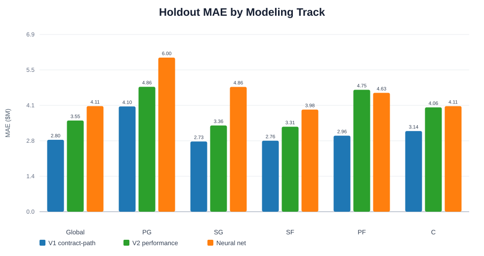
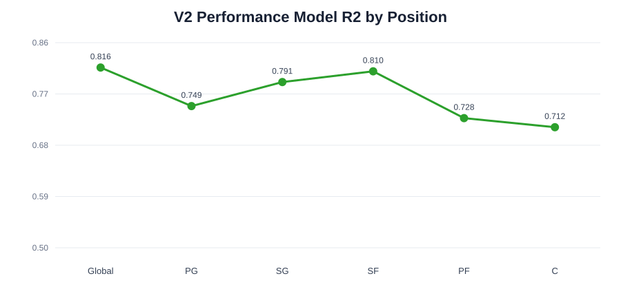
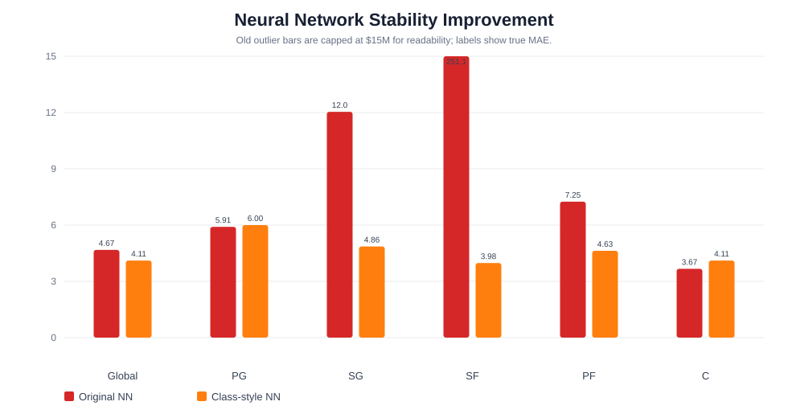

# NBA Salary Prediction ML Models

GSB545 Final Project

Last updated: 2026-06-03

## Project Objective

This project predicts an NBA player's salary for season `t+1` using information available through season `t`.

The project is built around a practical basketball question: how well can future salary be predicted from player production, role, durability, career stage, and contract context without accidentally using future information? To answer that, the repository compares three modeling tracks:

- **V1 Stable Contract-Path Model:** strongest raw forecasting accuracy, includes salary-history variables.
- **V2 Performance Model:** excludes salary-history variables to better isolate the relationship between basketball performance and future earnings.
- **Neural Network Baseline:** class-required Keras neural-network track used as a non-tree comparison model.

The final evaluation window is the 2023-2025 holdout period. Model selection and tuning use earlier seasons only.

## Visual Summary







## Repository Layout

| Path | Purpose |
|---|---|
| `Data_Vis/` | Exploratory analysis and project visualization files. |
| `V1 Model/` | V1 contract-path models with salary-history features. |
| `V2 Model(Performance Based)/` | V2 performance-only preseason models, cleaned V4 data, and saved V2 results. |
| `V2 Model(Performance Based)/NBADataCleanV4.csv` | Final cleaned player-season modeling dataset used by V2 and the neural network. |
| `V2 Model(Performance Based)/NBADataCleanV4_COLUMN_DEFINITIONS.md` | Supplemental definitions for V4-added columns and data-source notes. |
| `Neural Network/` | Keras neural-network notebooks and NN result summaries. |
| `Neural Network/run_neural_network.sh` | Reproducible command-line runner for the final Keras notebook. |
| `assets/` | README visual summaries generated from saved results. |
| `ML Project Data Sources.pdf` | Written documentation of external data sources. |
| `Project Brainstorm (1).pdf` | Project proposal and brainstorming document. |

The README uses repo-relative paths. If the cleaned CSV is stored somewhere else, update only `NBAML_CSV_PATH` in the commands below.

## Environment

The project uses Python with the standard data science stack plus boosted-tree and neural-network libraries.

| Package Area | Libraries Used |
|---|---|
| Data handling | `pandas`, `numpy` |
| Modeling and metrics | `scikit-learn` |
| Boosted trees | `xgboost`, `catboost`, `lightgbm` |
| Neural network | `tensorflow`, `keras`, `jupyter`, `nbconvert` |
| Reporting | Markdown, saved JSON/CSV model outputs, SVG README visuals |

## Dataset

The final modeling dataset is a player-season panel covering NBA seasons 2000-2025. Each row represents one player in one season and includes the target salary for the following season. In the submitted repo, the expected dataset path is `V2 Model(Performance Based)/NBADataCleanV4.csv`.

| Dataset Detail | Value |
|---|---:|
| Raw V4 rows | 10,469 |
| Targetable modeling rows after next-salary construction | 8,336 |
| Final holdout seasons | 2023-2025 |
| Training game threshold | `games >= 15` |
| Target variable | `next_salary` |
| Modeled target | `next_log_salary = log(next_salary)` |

### Data Sources

| Source | Used For |
|---|---|
| [Basketball-Reference advanced player tables](https://www.basketball-reference.com/leagues/NBA_2025_advanced.html) | PER, Win Shares, BPM, VORP, and other player impact measures. |
| [Basketball-Reference salary cap history](https://www.basketball-reference.com/contracts/salary-cap-history.html) | League salary-cap context by season. |
| [Basketball-Reference player contracts](https://www.basketball-reference.com/contracts/players.html) | Salary and player contract reference data. |
| [Spotrac NBA CBA cap history](https://www.spotrac.com/nba/cba) | CBA cap context and service-bucket interpretation. |
| [Spotrac luxury tax history](https://www.spotrac.com/nba/cba/tax) | Luxury-tax thresholds by season. |
| [Spotrac apron tracker](https://www.spotrac.com/nba/apron/_/year/2025) | First-apron and second-apron context for recent seasons. |

### Cleaning and Feature Engineering

The raw data required player identity normalization, consistent season-year alignment, franchise abbreviation cleanup, salary standardization, and careful handling of missing advanced metrics from older seasons. The final feature set combines:

- Traditional production: points, assists, rebounds, shooting, steals, blocks, turnovers, fouls, games, starts, and minutes.
- Advanced impact: `bbr_per`, `bbr_ws`, `bbr_ws_per_48`, `bbr_bpm`, `bbr_vorp`, true shooting, usage, net rating, and defensive rating.
- Availability and durability: games missed, games missed rate, availability rate, starter share.
- Career stage and CBA context: years of service, CBA service buckets, experience, draft indicators.
- Role and archetype: primary position groups, combo-position flags, and archetype indicators such as lead creator, three-and-D wing, stretch big, rim protector, and balanced connector.
- Time-safe history: prior-season and rolling 3-season performance features available before the target season.

### V2 Model Input Feature Dictionary

The table below documents every feature used by the saved V2 performance-model runs. The current V2 union contains 79 model-input features: 65 direct cleaned-data fields and 14 deterministic runtime features.

#### Direct Cleaned Dataset Features

| Feature | Definition |
|---|---|
| `adv_ast_to` | Advanced assist-to-turnover metric. |
| `adv_def_rating` | Advanced defensive rating, where lower values are better. |
| `adv_net_rating` | Advanced net rating, combining offensive and defensive impact. |
| `adv_true_shooting_pct` | True shooting percentage accounting for 2PT, 3PT, and FT efficiency. |
| `adv_usage_pct` | Usage rate, estimating share of team possessions used while on court. |
| `age` | Player age during the row season. |
| `all_star_selections_through_prev_season` | Cumulative All-Star selections through the prior season. |
| `archetype_confidence_score` | Confidence score for the assigned rule-based player archetype. |
| `archetype_is_balanced_connector` | Indicator for balanced connector archetype. |
| `archetype_is_interior_big_finisher` | Indicator for interior big finisher archetype. |
| `archetype_is_lead_creator_guard` | Indicator for lead creator guard archetype. |
| `archetype_is_rim_protector_big` | Indicator for rim protector big archetype. |
| `archetype_is_scoring_guard_wing` | Indicator for scoring guard or scoring wing archetype. |
| `archetype_is_stretch_big` | Indicator for stretch big archetype. |
| `archetype_is_three_and_d_wing` | Indicator for three-and-D wing archetype. |
| `archetype_scarcity_index` | Inverse of archetype share within the same season. |
| `archetype_share_in_season` | Share of players in the same archetype during the season. |
| `assists_pg` | Assists per game. |
| `bbr_bpm` | Basketball-Reference Box Plus/Minus. |
| `bbr_per` | Basketball-Reference Player Efficiency Rating. |
| `bbr_vorp` | Basketball-Reference Value Over Replacement Player. |
| `bbr_ws_per_48` | Basketball-Reference Win Shares per 48 minutes. |
| `blocks_pg` | Blocks per game. |
| `cba_bucket_is_0_2` | Indicator for 0-2 years of NBA service. |
| `cba_bucket_is_10_plus` | Indicator for 10+ years of NBA service. |
| `cba_bucket_is_3_6` | Indicator for 3-6 years of NBA service. |
| `cba_bucket_is_7_9` | Indicator for 7-9 years of NBA service. |
| `def_rebounds_pg` | Defensive rebounds per game. |
| `effective_fg_pct` | Effective field-goal percentage adjusted for three-point value. |
| `fg_attempted_pg` | Field-goal attempts per game. |
| `fouls_pg` | Personal fouls per game. |
| `ft_attempted_pg` | Free-throw attempts per game. |
| `ft_pct` | Free-throw percentage. |
| `games` | Games played in the row season. |
| `games_missed` | Estimated games missed, calculated from team games and games played. |
| `games_missed_rate` | Games missed divided by team games. |
| `games_started` | Games started. |
| `height_inches` | Player height in inches. |
| `minutes_per_game` | Minutes played per game. |
| `off_rebounds_pg` | Offensive rebounds per game. |
| `points_pg` | Points per game. |
| `position_is_combo` | Indicator for a multi-position or combo-position label. |
| `prev_all_def_any` | Prior-season All-Defensive selection indicator. |
| `prev_all_nba_any` | Prior-season All-NBA selection indicator. |
| `prev_assists_pg` | Prior-season assists per game. |
| `prev_award_all_star` | Prior-season All-Star indicator. |
| `prev_minutes_per_game` | Prior-season minutes per game. |
| `prev_points_pg` | Prior-season points per game. |
| `prev_rebounds_pg` | Prior-season rebounds per game. |
| `prev_team_win_pct_regular` | Prior-season team regular-season win percentage. |
| `rebounds_pg` | Total rebounds per game. |
| `reg_plus_minus_pg` | Regular-season plus/minus per game. |
| `rolling3_points_pg_prior` | Trailing three-season average of prior points per game. |
| `season` | Season-end year for the row. |
| `steals_pg` | Steals per game. |
| `team_net_points_pg` | Team point differential per game. |
| `team_region_central` | Indicator for central-region team mapping. |
| `team_region_east` | Indicator for east-region team mapping. |
| `team_region_west` | Indicator for west-region team mapping. |
| `team_win_pct_regular` | Team regular-season winning percentage. |
| `three_pt_attempted_pg` | Three-point attempts per game. |
| `three_pt_pct` | Three-point percentage. |
| `turnovers_pg` | Turnovers per game. |
| `weight_lbs` | Player weight in pounds. |
| `years_of_service` | NBA years of service used for experience and CBA context. |

#### Runtime Engineered Features

These fields are created inside the model pipeline from cleaned V4 columns, so they may not appear as direct source columns in the CSV.

| Feature | Definition |
|---|---|
| `availability_rate` | `games / team_games_regular`. |
| `championships_through_prev_season` | Championships won through the prior season. |
| `draft_number_clean` | Numeric draft number, with 0 used for missing or undrafted cases. |
| `draft_round_clean` | Numeric draft round, with 0 used for missing or undrafted cases. |
| `experience` | `season - draft_year_clean`, clipped to a valid career range. |
| `is_big` | Indicator for position containing PF or C. |
| `is_guard` | Indicator for position containing PG or SG. |
| `is_undrafted` | Indicator for missing, invalid, or undrafted draft information. |
| `is_wing` | Indicator for position containing SF. |
| `rolling3_net_rating_prior` | Trailing three-season average of prior advanced net rating. |
| `rolling3_team_win_pct_prior` | Trailing three-season average of prior team win percentage. |
| `rolling3_ts_prior` | Trailing three-season average of prior true shooting percentage. |
| `starter_share` | `games_started / games`. |
| `target_season` | Prediction season, calculated as `season + 1`. |

#### Features Intentionally Excluded From V2

V2 excludes salary-history predictors so that it measures performance-driven salary signal rather than contract carryover.

| Excluded Feature Type | Examples |
|---|---|
| Direct salary-history fields | `prev_salary`, `prev2_salary` |
| Salary-change fields | `prev_salary_growth`, raise/cut indicators |
| Salary volatility fields | multi-season salary volatility metrics |
| Current-row salary predictors | any direct use of current `salary` as an input feature |

Additional definitions for V4-added columns are documented in `V2 Model(Performance Based)/NBADataCleanV4_COLUMN_DEFINITIONS.md`.

## Modeling Tracks

### Shared Evaluation Design

All tracks use the same basic forecast framing: features from season `t` predict salary in season `t+1`. The primary target is `next_log_salary`, and metrics are reported after converting predictions back to USD.

| Component | Setup |
|---|---|
| Holdout window | Seasons 2023-2025 |
| Validation window | Seasons 2021-2022 for model/feature-pack selection where applicable |
| Training filter | `games >= 15` |
| Selection metric | `usd_mae` |
| Main reported metrics | USD MAE, USD RMSE, USD R2, plus log-space metrics in JSON outputs |
| Position models | Global, PG, SG, SF, PF, C |

### V1: Stable Contract-Path Model

Folder: `V1 Model`

V1 includes salary-history variables such as `prev_salary`, `prev2_salary`, salary growth, and salary volatility. It is the best track for pure forecasting accuracy because NBA salaries are path-dependent: multi-year contracts, extensions, options, and veteran salary structures carry information that performance metrics alone cannot fully recover.

How V1 is built:

- Uses XGBoost, CatBoost, LightGBM, and XGB/CatBoost blends.
- Builds one global model and five position-specific models.
- Includes both basketball features and salary-history features.
- Selects final model by holdout/validation performance stored in `V1 Model/results/*_metrics.json`.

### V2: Performance Model

Folder: `V2 Model(Performance Based)`

V2 intentionally removes salary-history predictors to answer the more interpretable question: how much of next-season salary can be explained by performance, role, durability, career stage, team context, and CBA rules?

How V2 is built:

- Uses XGBoost, CatBoost, LightGBM, and XGB/CatBoost blends.
- Uses `RandomizedSearchCV` with stratified folds on a binned regression target, falling back to `KFold` when needed.
- Tunes two feature packs: `prior_perf_core_v1` and `prior_perf_rolling_v1`.
- Tunes blend weights on the 2021-2022 validation window.
- Uses the same global and position-specific structure as V1.

V2 full-run configuration used for the saved results:

| Setting | Value |
|---|---:|
| Randomized search iterations | 6 |
| CV splits | 3 |
| Blend weight step | 0.10 |
| LightGBM enabled | yes |
| Cache behavior | JSON result files saved in `results/` |

V2 feature packs:

| Feature Pack | Description |
|---|---|
| `prior_perf_core_v1` | Core performance, role, service, draft, CBA, team, and impact features. |
| `prior_perf_rolling_v1` | Core pack plus prior-season, rolling, awards, durability, and archetype/scarcity features. |

Explicitly excluded from V2:

- `prev_salary`
- `prev2_salary`
- `prev_salary_growth`
- salary volatility features
- raise/cut salary-history features

### Neural Network Track

Folder: `Neural Network`

The neural-network track uses Keras feed-forward multilayer perceptrons as a non-tree comparison model. It exists for two reasons: to satisfy the neural-network requirement for the project and to test whether a dense network can compete with boosted trees on this tabular salary problem.

Final notebook:

- `Neural Network/NBA_Performance_Salary_NN_ClassStyle_Stronger.ipynb`

Final architecture and training setup:

- Standardized numeric and one-hot categorical inputs.
- Standardized log-salary target for training stability.
- Dense MLP with hidden layers of 320, 192, and 96 units.
- ReLU activations, dropout of 0.18, L2 regularization of 0.00015.
- Adam optimizer with learning rate 0.0008.
- Huber loss, early stopping, and learning-rate scheduling.
- Same V2 performance-only feature framing and 2023-2025 holdout split.

The neural network improved substantially over the first NN attempt, especially by removing catastrophic position-level blowups. It still does not replace the boosted-tree models as the best final approach.

## Final Holdout Results

All metrics below are evaluated on the 2023-2025 holdout window. MAE and RMSE are reported in nominal USD.

### V1 Stable Contract-Path Results

| Player Group | Selected Model | MAE (USD) | RMSE (USD) | R2 (USD) |
|---|---|---:|---:|---:|
| Global | CatBoost | 2,797,707 | 4,966,766 | 0.82199 |
| Point Guard | Blend | 4,097,235 | 7,328,379 | 0.73725 |
| Shooting Guard | CatBoost | 2,733,830 | 4,760,295 | 0.75966 |
| Small Forward | Blend | 2,763,402 | 5,098,684 | 0.78764 |
| Power Forward | CatBoost | 2,958,632 | 4,773,451 | 0.85339 |
| Center | LightGBM | 3,138,772 | 5,411,882 | 0.75661 |

### V2 Performance-Only Results

These are the saved full-run V2 results using `n_iter=6`, `cv=3`, `blend_step=0.10`, and LightGBM enabled.

| Player Group | Selected Model | Feature Pack | MAE (USD) | RMSE (USD) | R2 (USD) |
|---|---|---|---:|---:|---:|
| Global | Blend | `prior_perf_rolling_v1` | 3,549,686 | 5,427,618 | 0.81637 |
| Point Guard | Blend | `prior_perf_rolling_v1` | 4,861,932 | 7,551,659 | 0.74869 |
| Shooting Guard | Blend | `prior_perf_rolling_v1` | 3,355,496 | 5,180,957 | 0.79094 |
| Small Forward | LightGBM | `prior_perf_rolling_v1` | 3,308,374 | 4,933,581 | 0.80979 |
| Power Forward | Blend | `prior_perf_core_v1` | 4,745,552 | 7,133,229 | 0.72765 |
| Center | Blend | `prior_perf_rolling_v1` | 4,061,805 | 6,175,218 | 0.71160 |

### Neural Network Results

The neural network is reported from `Neural Network/results/nn_classstyle_holdout_summary.csv`.

| Player Group | Model | MAE (USD) | RMSE (USD) | R2 (USD) | MAE (log) |
|---|---|---:|---:|---:|---:|
| Global | Keras MLP | 4,110,050 | 6,142,067 | 0.76484 | 0.60143 |
| Point Guard | Keras MLP | 5,999,568 | 9,012,875 | 0.64203 | 0.74645 |
| Shooting Guard | Keras MLP | 4,858,824 | 7,514,062 | 0.56025 | 0.68144 |
| Small Forward | Keras MLP | 3,975,477 | 6,147,362 | 0.70468 | 0.60713 |
| Power Forward | Keras MLP | 4,627,362 | 7,083,718 | 0.73141 | 0.67419 |
| Center | Keras MLP | 4,108,144 | 6,701,530 | 0.66034 | 0.54909 |

The neural network performs meaningfully better than the first NN notebook but still trails the best tree-based V2 models in most groups. The strongest NN position result is Power Forward, where the NN MAE is slightly lower than the V2 boosted-tree result (`$4.63M` vs `$4.75M`). The global NN result remains behind the V2 global blend (`$4.11M` vs `$3.55M` MAE), which supports the final conclusion that boosted trees are better suited to this dataset.

### Neural Network Improvement Over First Attempt

The first NN notebook produced unstable outlier predictions for several positions. The class-style notebook fixed that instability through target scaling, stronger regularization, Huber loss, and prediction clipping during evaluation.

| Player Group | First NN MAE | Final NN MAE | Change |
|---|---:|---:|---:|
| Global | 4.67M | 4.11M | -0.56M |
| Point Guard | 5.91M | 6.00M | +0.09M |
| Shooting Guard | 12.04M | 4.86M | -7.18M |
| Small Forward | 251.12M | 3.98M | -247.14M |
| Power Forward | 7.25M | 4.63M | -2.62M |
| Center | 3.67M | 4.11M | +0.44M |

## V1 vs V2 Interpretation

| Player Group | V1 MAE | V2 MAE | Added Error Without Salary History |
|---|---:|---:|---:|
| Global | 2.80M | 3.55M | +0.75M |
| Point Guard | 4.10M | 4.86M | +0.76M |
| Shooting Guard | 2.73M | 3.36M | +0.62M |
| Small Forward | 2.76M | 3.31M | +0.54M |
| Power Forward | 2.96M | 4.75M | +1.79M |
| Center | 3.14M | 4.06M | +0.92M |

V1 wins on raw accuracy because prior salary carries contract-path information. V2 remains strong enough to support the performance-first interpretation: role, production, experience, CBA stage, and durability explain a large share of future salary even without previous salary.

The largest V1-to-V2 drop occurs for Power Forwards and Centers, suggesting frontcourt salaries are more contract-path dependent. Guards and wings remain closer to V1, which suggests their salaries are somewhat more explainable from measurable production and role context.

## What the V2 Model Learned

| Player Group | Strongest Predictors From Saved V2 XGBoost Importances |
|---|---|
| Global | `minutes_per_game`, `prev_minutes_per_game`, `cba_bucket_is_0_2`, `prev_points_pg`, `points_pg` |
| Point Guard | `is_undrafted`, `assists_pg`, `minutes_per_game`, `points_pg`, `prev_points_pg` |
| Shooting Guard | `minutes_per_game`, `points_pg`, `prev_points_pg`, `prev_minutes_per_game`, `years_of_service` |
| Small Forward | `minutes_per_game`, `prev_minutes_per_game`, `prev_points_pg`, `points_pg`, `rolling3_points_pg_prior` |
| Power Forward | `minutes_per_game`, `points_pg`, `cba_bucket_is_0_2`, `draft_round_clean`, `years_of_service` |
| Center | `minutes_per_game`, `cba_bucket_is_0_2`, `def_rebounds_pg`, `rebounds_pg`, `years_of_service` |

Main takeaways:

- Minutes and role load are the most consistent salary signals across positions.
- CBA service buckets matter because they structure max-contract eligibility and rookie-scale constraints.
- Prior and rolling performance metrics improve stability without using salary history.
- Guards are driven more by assists, scoring, and role creation.
- Centers are driven more by minutes, rebounding, defense, and availability.
- Draft status and years of service remain meaningful even after controlling for on-court production.

## Model Families

| Model | How It Is Built | Role in Project |
|---|---|---|
| XGBoost | Gradient-boosted regression trees tuned with randomized search over tree depth, learning rate, estimators, subsampling, column sampling, and regularization. | Captures nonlinear interactions between production, role, service time, and team context; provides useful feature importances. |
| CatBoost | Gradient boosting model trained through a sklearn-compatible wrapper so it can be tuned and scored consistently with the other regressors. | Strong on grouped/categorical-style structure such as positions and archetypes; dominant in several V1 runs and competitive in V2. |
| LightGBM | Histogram-based boosted trees enabled in the full V2 runs for faster leaf-wise learning on tabular features. | Fast and effective for repeated tuning; selected for the full Small Forward V2 model and several quick-run position models. |
| Blend | Convex blend of XGBoost and CatBoost predictions; blend weight is selected on the validation window by USD MAE. | Reduces variance on a noisy, skewed salary target and wins several global/position runs. |
| Neural Network | Keras MLP with standardized inputs, standardized log target, dense ReLU layers, dropout, L2 regularization, Huber loss, early stopping, and LR scheduling. | Useful non-tree baseline and class requirement; improved with regularization but does not outperform boosted trees overall. |

## Output Files

| Output | Description |
|---|---|
| `V1 Model/results/*_metrics.json` | V1 selected models, metrics, and cached result metadata. |
| `V2 Model(Performance Based)/results/*_metrics.json` | V2 selected models, feature packs, metrics, tuning configuration, and top XGBoost importances. |
| `Neural Network/results/nn_classstyle_holdout_summary.csv` | Final neural-network holdout summary by player group. |
| `Neural Network/results/nn_classstyle_all_holdout_metrics.json` | Final global neural-network validation and holdout metrics. |
| `assets/*.svg` | README visuals generated from saved result files. |

## How to Reproduce

Run these commands from the repository root after installing the required Python packages.

### V1 Stable Contract-Path Models

```bash
cd "V1 Model"
bash run_all_models.sh
```

### V2 Performance Models: Fast Run

```bash
cd "V2 Model(Performance Based)"

NBAML_CSV_PATH="NBADataCleanV4.csv" \
NBAML_DISABLE_XGB=0 \
NBAML_DISABLE_LGBM=0 \
NBAML_PRESEASON_N_ITER_SINGLE=2 \
NBAML_PRESEASON_CV_SPLITS=2 \
NBAML_BLEND_WEIGHT_STEP=0.20 \
NBAML_SELECTION_METRIC=usd_mae \
NBAML_FORCE_RETRAIN=1 \
bash run_fast_dev.sh
```

### V2 Performance Models: Full Run

```bash
cd "V2 Model(Performance Based)"

NBAML_CSV_PATH="NBADataCleanV4.csv" \
NBAML_DISABLE_XGB=0 \
NBAML_DISABLE_LGBM=0 \
NBAML_PRESEASON_N_ITER_SINGLE=6 \
NBAML_PRESEASON_CV_SPLITS=3 \
NBAML_BLEND_WEIGHT_STEP=0.10 \
NBAML_SELECTION_METRIC=usd_mae \
NBAML_FORCE_RETRAIN=1 \
bash run_all_models.sh
```

### Neural Network

Command-line run:

```bash
cd "Neural Network"
bash run_neural_network.sh
```

Equivalent direct notebook execution:

```bash
cd "Neural Network"

python -m jupyter nbconvert \
  --execute \
  --to notebook \
  --inplace \
  --ExecutePreprocessor.timeout=7200 \
  --ExecutePreprocessor.kernel_name=python3 \
  "NBA_Performance_Salary_NN_ClassStyle_Stronger.ipynb"
```

Notebook to inspect manually:

- `Neural Network/NBA_Performance_Salary_NN_ClassStyle_Stronger.ipynb`

Saved NN outputs:

- `Neural Network/results/nn_classstyle_holdout_summary.csv`
- `Neural Network/results/nn_classstyle_all_holdout_metrics.json`

Environment note:

- The notebook includes a `pyarrow` import workaround for environments where TensorFlow and the real `pyarrow` binary conflict.

## Current Limitations

- Salary is highly right-skewed, so a small number of max-contract players can heavily affect RMSE and R2.
- V2 intentionally excludes previous salary, which improves interpretability but gives up contract-carryover information.
- Market-size, media exposure, endorsement value, jersey sales, agent effects, and negotiation context are not included.
- CBA changes and salary-cap jumps introduce structural breaks that are difficult to fully model from historical player stats alone.
- Position labels shift over time, especially for modern guards, wings, and stretch bigs.
- Neural networks are less stable than boosted trees on this dataset size and remain a comparison baseline rather than the primary model.

## Conclusion

V1 is the best choice for pure next-salary forecasting because prior salary captures contract structure directly. V2 is the better answer to the project question because it estimates future salary from basketball performance and non-salary context. The strongest final interpretation is that NBA salary is substantially performance-driven, but the remaining error reflects contract path dependence, CBA rules, and market factors that are only partially visible in the current dataset.
